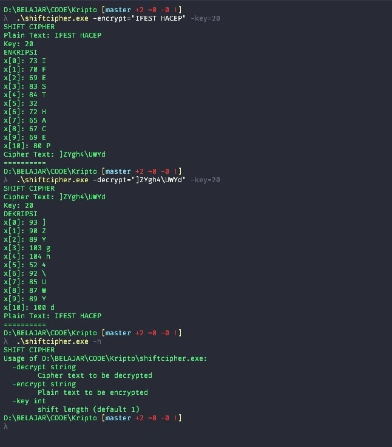

# SHIFT CIPHER

140810180074 - Naufal Aulia K.

Simple Shift Cipher Implementation using GO. Using Printable ASCII Characters as Dictionary

## HOW TO USE

[Get a Golang Compiler](https://golang.org/dl/), if you havent already

Compile code to a binary format

```
go build shiftchiper.go
```
You can run the binary file with the following arguments

```
-h                to show list of arguments
-key=int          to provide a shift amount (default=1)
-encrypt="string" to encrypt the inputted string
-decrypt="string" to decrypt the inputted string
```

## SCREENSHOT


